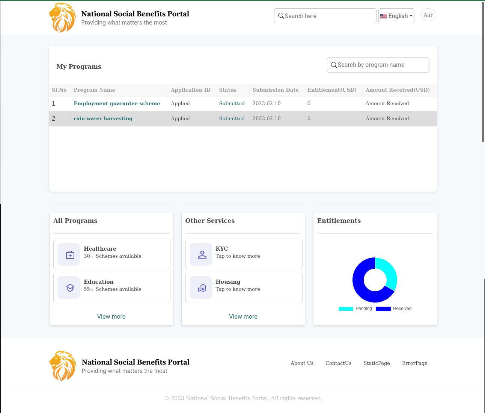

# Self Service Portal - Main Dashboard

## Target

- For logged user, He/She can access
  1. User registered programs
  2. All services, programs available links
  3. Data pie chart which display Entitlements particulars as pending,receiving amount for respective user

## Technology used

Following technologies have used:

- xml: Used for creating the structure of the website
- CSS: Used for styling the website and making it visually appealing
- JavaScript: Used for adding interactivity to the website and Added functionality
- Odoo: Used for provides a range of features and functionalities, including website management
- Python: Used for implementing business logic and build website modules

## Screens Designed

- Header
- My programs
- Available services,Entitlements
- Footer

### Screenshot Updated

## Functionalities Added

### Header

- Logo with portal name is clickable and go to main
- Search bar is placed in header. As of now no functionality is added
- Language selection option provided. As of now, it is static
- User icon is placed with dropdown feature of user profile and logout options

### Myprograms

- Write a logic in controllers and bring data to table which is shown in myprograms
- Search and sort functionalities are added

### Cards

- Cards of All Programs, Other Services, Entitlements have designed

### Footer

- Logo with portal name is clickable and goes to main
- Nav links added to link to other pages
- Copyright link also added
